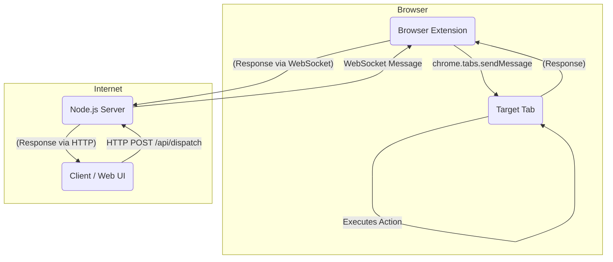

# GEMINI.md - Project Constitution & Guide

This document is the primary guide for any AI agent assisting in the development of **ChatGPT-buddy**. Its purpose is to ensure consistency, maintain architectural integrity, and provide a single source of truth for the project's design and principles.

**As an AI assistant, you MUST adhere to the principles and structures outlined in this document for all code generation, refactoring, and architectural discussions.**

## 1. High-Level Project Goal

ChatGPT-buddy is a tool that allows external clients to interact with specific browser tabs programmatically. It consists of two main components:
1.  A **Node.js Server** that acts as a secure gateway and message router.
2.  A **Browser Extension** that receives commands from the server and executes them within a target browser tab.

The core workflow is: **Client -> Server -> Browser Extension -> Target Tab**.

There are other secondary components: WebUI, clients and language SDKs.

## 2. Core Principles

-   **TypeScript First**: All code, for both the server and the extension, MUST be written in TypeScript. Use strong typing and interfaces wherever possible.
-   **Security is Paramount**: The connection between the server and the extension must be secure. The server must validate all incoming client requests. Never trust user-controlled input.
-   **Modularity and Separation of Concerns**: Each component (server, extension background, content script) has a distinct role. Do not mix logic.
-   **Robust Error Handling**: Every asynchronous operation, API call, and message handler must include comprehensive `try...catch` blocks and clear error reporting.
-   **Structured Communication**: All communication between components MUST use the JSON-based message protocol defined in this document.
-   **Clarity and Documentation**: Generate code that is clean, readable, and includes TSDoc comments for all public functions, classes, and interfaces.
-   **Adopt DDD, Hexagonal architecture and Event-Driven Architecture**: Enforce strict separation of the domain, infrastructure and application layers. All interactions come, by definition, from primary ports, implemented in the infrastructure layer. They gather all information and build an meaningful event, that is then passed to the `accept(event)` method of the `application`. The `application` instance is injected into the adapter. 

## 3. Architecture Overview



### Component Breakdown:

1.  **Client**: An external service (e.g., a web dashboard, a cURL script, another application) that initiates a request. It only communicates with the Server via a REST API.

2.  **Node.js Server (`server/`)**:
    -   **Role**: Authenticate clients, validate incoming requests, manage WebSocket connections to browser extensions, and route messages.
    -   **Technology**: Node.js with Express.js (or Fastify) and the `ws` library for WebSockets.
    -   **Key Logic**:
        -   Maintains a map of `extensionId` to active `WebSocket` connections.
        -   Exposes a REST endpoint (e.g., `POST /api/dispatch`) for clients.
        -   When a request is received, it forwards the command payload to the appropriate extension via its WebSocket connection.

3.  **Browser Extension (`extension/`)**:
    -   **Role**: Listen for commands from the server and execute them in the browser.
    -   **Manifest**: `manifest.v3`
    -   **`background.ts` (Service Worker)**:
        -   Maintains a persistent WebSocket connection to the server.
        -   Authenticates itself with the server upon connection (e.g., with a secret key).
        -   Listens for incoming messages from the server.
        -   Uses `chrome.tabs.sendMessage()` to forward the command to the appropriate content script.
    -   **`content_script.ts`**:
        -   Injects into web pages.
        -   Listens for messages from the background script using `chrome.runtime.onMessage`.
        -   Executes the command on the page (e.g., query the DOM, fill a form, click a button).
        -   Sends a result (success or error) back to the background script.

## 4. Communication Protocol & Data Structures

All communication between the server and the extension background script, and between the background and content scripts, will use a standardized JSON message format.

**Create a `shared/` directory for common TypeScript types used by both the server and the extension to ensure consistency.**

### Core Message Interface (`shared/types.ts`)

```typescript
// A unique identifier for tracking a request through the system
type CorrelationId = string;

// The type of action to be performed in the content script
type ActionType = 'SELECT_PROJECT' | 'SELECT_CHAT' | 'GET_RESPONSE' | 'FILL_PROMPT' | 'DOWNLOAD_IMAGE';

// Base interface for all messages
interface BaseMessage<T extends ActionType, P> {
  action: T;
  payload: P;
  correlationId: CorrelationId;
}

// Example Payloads
interface SelectProjectPayload {
  selector: string;
}

interface SelectChatPayload {
  selector: string;
}

interface GetResponsePayload {
  selector: string;
}

interface FillPromptPayload {
  selector: string;
  value: string;
}

interface DownloadImagePayload {
  selector: string;
}

// Specific Message Types
export type SelectProjectMessage = BaseMessage<'SELECT_INPUT', SelectProjectPayload>;
export type SelectChatMessage = BaseMessage<'SELECT_INPUT', SelectChatPayload>;
export type GetResponseMessage = BaseMessage<'GET_RESPONSE', GetResponsePayload>;
export type FillPromptMessage = BaseMessage<'FILL_INPUT', FillPromptPayload>;
export type DownloadImageMessage = BaseMessage<'DOWNLOAD_IMAGE', DownloadImagePayload>;


// Union type for all possible messages sent to a content script
export type AgentMessage = SelectProjectMessage | SelectChatMessage | GetResponseMessage | FillPromptMessage | DownloadImageMessage;

// Response message from content script to background/server
export interface ActionResponse {
    correlationId: CorrelationId;
    status: 'success' | 'error';
    data?: any; // e.g., the page title, or text content
    error?: string; // A descriptive error message
}
```

### Server Dispatch Payload (`POST /api/dispatch`)

The client sends this to the server.

```json
{
  "target": {
    "extensionId": "some_unique_id_for_the_extension_instance",
    "tabId": 123
  },
  "message": {
    "action": "SELECT_PROJECT",
    "payload": {
      "selector": "#storytelling",
    },
    "correlationId": "abc-123-def-456"
  }
}
```

The server then forwards the `message` object to the specified extension over WebSockets, including the `tabId`.

## 5. Instructions for the AI Assistant

1.  **Acknowledge This Document**: Start your first response by confirming you have read and understood this `GEMINI.md` file.
2.  **Context is Key**: When I ask for a new feature (e.g., "add the ability to get an element's text"), you MUST provide the necessary code changes for **all relevant components**:
    -   The type definition in `shared/types.ts`.
    -   The server-side logic (if any).
    -   The `background.ts` message handler.
    -   The `content_script.ts` action executor.
3.  **File Paths**: When providing code, always specify the full path of the file being modified (e.g., `extension/content_script.ts`).
4.  **Code Blocks**: Use fenced code blocks with the correct language identifier (e.g., ```typescript).
5.  **Be Explicit**: Do not assume I have context from previous conversations unless it's in the same session. When in doubt, ask for clarification.
6.  **Directory Structure**: Assume the following project structure. When adding new files, place them accordingly.
    ```
    chatgpt-buddy/
    ├── server/
    │   ├── src/
    │   │   ├── index.ts
    │   │   └── services/
    │   ├── package.json
    │   └── tsconfig.json
    ├── extension/
    │   ├── src/
    │   │   ├── background.ts
    │   │   ├── content_script.ts
    │   │   └── popup.ts
    │   ├── manifest.json
    │   ├── package.json
    │   └── tsconfig.json
    ├── shared/
    │   └── types.ts
    └── GEMINI.md
    ```

## 6. Example Interaction

**My Prompt:**
> "Let's implement the `GET_PAGE_TITLE` action."

**Your Ideal Response:**
> Acknowledged. I have read the `GEMINI.md` guide. To implement the `GET_PAGE_TITLE` action, we need to update three files.
>
> First, let's define the message type in `shared/types.ts`.
>
> ```typescript
> // In shared/types.ts
>
> // ... existing types
> export type SelectProjectMessage = BaseMessage<'SELECT_PROJECT', SelectProjectPayload>;
>
> // Add it to the union type
> export type AgentMessage = /* ...other messages | */ SelectProjectMessage;
> ```
>
> Next, in the extension's background script, we'll forward the message to the content script.
>
> ```typescript
> // In extension/src/background.ts
>
> // Assuming 'ws' is the WebSocket connection and it receives a message
> ws.on('message', (data) => {
>   const { tabId, message } = JSON.parse(data.toString());
>   if (message.action === 'SELECT_PROJECT') {
>     chrome.tabs.sendMessage(tabId, message, (response: ActionResponse) => {
>       // Send the response back to the server
>       ws.send(JSON.stringify(response));
>     });
>   }
>   // ... other action handlers
> });
> ```
>
> Finally, we implement the logic in the content script to get the title and respond.
>
> ```typescript
> // In extension/src/content_script.ts
>
> chrome.runtime.onMessage.addListener((message: AgentMessage, sender, sendResponse) => {
>   if (message.action === 'SELECT_PROJECT') {
>     try {
>       const title = document.title;
>       const response: ActionResponse = {
>         correlationId: message.correlationId,
>         status: 'success',
>         data: title,
>       };
>       sendResponse(response);
>     } catch (e) {
>       const response: ActionResponse = {
>         correlationId: message.correlationId,
>         status: 'error',
>         error: e.message,
>       };
>       sendResponse(response);
>     }
>   }
>   // Return true to indicate you will send a response asynchronously
>   return true;
> });
> ```

## Domain-Driven Design and Hexagonal Architecture layout

Note on primary and secondary ports:

- Primary Port (Domain): Entry point for domain logic (e.g., Aggregates receiving events).
- Primary Adapter (Infrastructure): An element in the infrastructure layer that interacts with the outside and reacts upon new external events.
- Secondary Port (Domain): Interface the domain uses to communicate with outside world, because the domain is requesting something from the outside.
- Secondary Adapter (Infrastructure): Implementation of a secondary port.

Following the *DDD* terminology, we use the term "primary port" to identify points in which the domain receives events from the outside. We use also the term "primary port" to the instance in the infrastructure layer responsible of interacting with the outside, gathering information, and packaging it as an incoming domain event, even though technically is a *primary adapter*. "Secondary ports" are infrastructure entities that communicate with the outside world, as requested by the Domain layer. From the domain perspective, any interaction comes from a domain event, and always produces cero, one or more events.

From a code standpoint, a "Port" is an interface in the Domain layer, and an "Adapter" is a class in the Infrastructure layer that implements a "Port", and gets injected in the Domain by the Application layer (and later available through the `#resolve(Port)` method in the `Ports` class).


### Python SDK

For the Python SDK, this project uses a strict module structure to respect the boundaries of the three layers:

- `/python_client/rydnr/tools/chatgpt_buddy/domain`: The Domain layer.
- `/python_client/rydnr/tools/chatgpt_buddy/application`: The Application layer.
- `/python_client/rydnr/tools/chatgpt_buddy/infrastructure`: The Infrastructure layer.

The Python SDK uses Python-EDA:
- https://github.com/pythoneda-shared-pythonlang/domain: Support for domain classes
- https://github.com/pythoneda-shared-pythonlang/infrastructure: Common infrastructure adapters
- https://github.com/pythoneda-shared-pythonlang/application: Application layer

Don't worry about how manage those modules as dependencies. ChatGPT-buddy Python SDK will run as a Nix flake with the required dependencies and context.

All parameters expected from the user, if running from the CLI, must be handled by CLI handlers in the infrastructure layer. Use this other project as guide if needed: https://github.com/rydnr/nix-flake-to-graphviz/

As a Python SDK, the developer must be able to use it easily:
```python
from rydnr.tools.chatgpt_buddy.infrastructure import Client

class ChatGPTBuddyClient:

    async def main():
        client = Client(url, apiKey)
        await client.select_project('python')
```

All Python packages must include an `__init__.py` file like the following:
```python
# vim: set fileencoding=utf-8
"""
rydnr/tools/chatgpt_buddy/infrastructure/cli/__init__.py

This file ensures rydnr.tools.chatgpt_buddy.infrastructure.cli is a namespace.

Copyright (C) 2025-today rydnr's chatgpt-buddy

This program is free software: you can redistribute it and/or modify
it under the terms of the GNU General Public License as published by
the Free Software Foundation, either version 3 of the License, or
(at your option) any later version.

This program is distributed in the hope that it will be useful,
but WITHOUT ANY WARRANTY; without even the implied warranty of
MERCHANTABILITY or FITNESS FOR A PARTICULAR PURPOSE.  See the
GNU General Public License for more details.

You should have received a copy of the GNU General Public License
along with this program.  If not, see <https://www.gnu.org/licenses/>.
"""
__path__ = __import__("pkgutil").extend_path(__path__, __name__)

from .select_project_cli import SelectProjectCLI
```

#### Rules

- No static imports or wildcard imports are allowed. If possible, group imports by their top-level groups.
- No data/record classes are allowed. Classes should model behavior, not only data. Events or Exceptions might be corner cases to this general rule, which is a guide, not an obligation.
- Also, classes should not be stateless. They should encapsulate state and behavior.

---


This concludes the guide. Adherence to these rules will ensure a successful and efficient development process.
