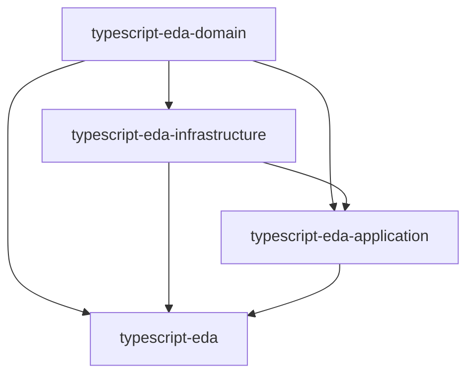

# CI/CD Orchestration Guide for Multi-Repository Publishing

This guide outlines the comprehensive CI/CD strategy for the ChatGPT-Buddy ecosystem across multiple repositories.

## Overview

The ecosystem consists of **3 organization scopes** with **15+ repositories** that must be published in a specific order due to dependency relationships.

## Publishing Order & Dependencies

### Phase 1: Foundation (TypeScript-EDA)


1. **@typescript-eda/domain** (No dependencies)
2. **@typescript-eda/infrastructure** (Depends on: domain)
3. **@typescript-eda/application** (Depends on: domain, infrastructure)
4. **typescript-eda** (Meta-package, depends on: all above)

### Phase 2: Web-Buddy Framework
```mermaid
graph TD
    E[typescript-eda packages] --> F[@web-buddy/core]
    E --> G[@web-buddy/contract-declaration]
    F --> H[@web-buddy/google-buddy]
    F --> I[@google-buddy/client]
    F --> J[@web-buddy/nodejs-server]
    F --> K[@web-buddy/browser-extension]
    F --> L[@web-buddy/framework]
    H --> L
    I --> L
    J --> L
    K --> L
```

5. **@web-buddy/core** (Depends on: typescript-eda)
6. **@web-buddy/contract-declaration** (Depends on: typescript-eda)
7. **@web-buddy/nodejs-server** (Depends on: core)
8. **@web-buddy/browser-extension** (Depends on: core)
9. **@web-buddy/google-buddy** (Depends on: core)
10. **@google-buddy/client** (Depends on: core)
11. **@web-buddy/framework** (Meta-package, depends on: all above)

### Phase 3: ChatGPT-Buddy Implementation
```mermaid
graph TD
    M[web-buddy packages] --> N[@chatgpt-buddy/core]
    N --> O[@chatgpt-buddy/server]
    N --> P[@chatgpt-buddy/extension]
    N --> Q[@chatgpt-buddy/client-ts]
    N --> R[chatgpt-buddy]
    O --> R
    P --> R
    Q --> R
```

12. **@chatgpt-buddy/core** (Depends on: web-buddy, typescript-eda)
13. **@chatgpt-buddy/server** (Depends on: core)
14. **@chatgpt-buddy/extension** (Depends on: core)
15. **@chatgpt-buddy/client-ts** (Depends on: core)
16. **chatgpt-buddy** (Main package, depends on: all above)

## Orchestration Workflows

### Master Orchestration Workflow

**Repository**: `chatgpt-buddy-orchestrator` (Central coordination)

```yaml
name: Multi-Repository Publishing Orchestration

on:
  workflow_dispatch:
    inputs:
      release_type:
        description: 'Release type'
        required: true
        default: 'patch'
        type: choice
        options:
        - major
        - minor
        - patch
      packages_to_release:
        description: 'Packages to release (comma-separated) or "all"'
        required: true
        default: 'all'

jobs:
  orchestrate-release:
    runs-on: ubuntu-latest
    
    steps:
    - name: Checkout orchestrator
      uses: actions/checkout@v4
    
    - name: Setup Node.js
      uses: actions/setup-node@v4
      with:
        node-version: '20'
    
    - name: Install orchestration tools
      run: npm install -g semver conventional-changelog-cli
    
    - name: Calculate new versions
      id: versions
      run: |
        echo "Calculating new versions for release type: ${{ github.event.inputs.release_type }}"
        # Version calculation logic here
        echo "typescript_eda_version=1.1.0" >> $GITHUB_OUTPUT
        echo "web_buddy_version=1.1.0" >> $GITHUB_OUTPUT
        echo "chatgpt_buddy_version=0.2.0" >> $GITHUB_OUTPUT
    
    - name: Phase 1 - TypeScript-EDA Release
      uses: ./.github/workflows/phase-release.yml
      with:
        phase: typescript-eda
        version: ${{ steps.versions.outputs.typescript_eda_version }}
        repositories: |
          typescript-eda-domain
          typescript-eda-infrastructure
          typescript-eda-application
          typescript-eda
      secrets:
        NPM_TOKEN: ${{ secrets.NPM_TOKEN_TYPESCRIPT_EDA }}
        GITHUB_TOKEN: ${{ secrets.ORCHESTRATOR_GITHUB_TOKEN }}
    
    - name: Phase 2 - Web-Buddy Release
      needs: phase-1
      uses: ./.github/workflows/phase-release.yml
      with:
        phase: web-buddy
        version: ${{ steps.versions.outputs.web_buddy_version }}
        repositories: |
          web-buddy-core
          web-buddy-contract-declaration
          web-buddy-nodejs-server
          web-buddy-browser-extension
          web-buddy-google-buddy
          google-buddy-client
          web-buddy-framework
      secrets:
        NPM_TOKEN: ${{ secrets.NPM_TOKEN_WEB_BUDDY }}
        GITHUB_TOKEN: ${{ secrets.ORCHESTRATOR_GITHUB_TOKEN }}
    
    - name: Phase 3 - ChatGPT-Buddy Release
      needs: phase-2
      uses: ./.github/workflows/phase-release.yml
      with:
        phase: chatgpt-buddy
        version: ${{ steps.versions.outputs.chatgpt_buddy_version }}
        repositories: |
          chatgpt-buddy-core
          chatgpt-buddy-server
          chatgpt-buddy-extension
          chatgpt-buddy-client-ts
          chatgpt-buddy
      secrets:
        NPM_TOKEN: ${{ secrets.NPM_TOKEN_CHATGPT_BUDDY }}
        GITHUB_TOKEN: ${{ secrets.ORCHESTRATOR_GITHUB_TOKEN }}
    
    - name: Generate release notes
      run: |
        echo "# Multi-Repository Release ${{ steps.versions.outputs.chatgpt_buddy_version }}" > release-notes.md
        echo "" >> release-notes.md
        echo "## TypeScript-EDA v${{ steps.versions.outputs.typescript_eda_version }}" >> release-notes.md
        echo "## Web-Buddy v${{ steps.versions.outputs.web_buddy_version }}" >> release-notes.md
        echo "## ChatGPT-Buddy v${{ steps.versions.outputs.chatgpt_buddy_version }}" >> release-notes.md
    
    - name: Create ecosystem release
      uses: actions/create-release@v1
      env:
        GITHUB_TOKEN: ${{ secrets.GITHUB_TOKEN }}
      with:
        tag_name: ecosystem-v${{ steps.versions.outputs.chatgpt_buddy_version }}
        release_name: Ecosystem Release v${{ steps.versions.outputs.chatgpt_buddy_version }}
        body_path: release-notes.md
        draft: false
        prerelease: false
```

### Phase Release Workflow Template

**File**: `.github/workflows/phase-release.yml` (Reusable workflow)

```yaml
name: Phase Release Workflow

on:
  workflow_call:
    inputs:
      phase:
        required: true
        type: string
      version:
        required: true
        type: string
      repositories:
        required: true
        type: string
    secrets:
      NPM_TOKEN:
        required: true
      GITHUB_TOKEN:
        required: true

jobs:
  trigger-releases:
    runs-on: ubuntu-latest
    
    strategy:
      matrix:
        repo: ${{ fromJson(inputs.repositories) }}
      max-parallel: 1  # Sequential execution within phase
    
    steps:
    - name: Trigger repository release
      uses: actions/github-script@v7
      with:
        github-token: ${{ secrets.GITHUB_TOKEN }}
        script: |
          const repo = '${{ matrix.repo }}';
          const version = '${{ inputs.version }}';
          
          console.log(`Triggering release for ${repo} version ${version}`);
          
          await github.rest.actions.createWorkflowDispatch({
            owner: 'rydnr',
            repo: repo,
            workflow_id: 'release.yml',
            ref: 'main',
            inputs: {
              version: version,
              release_type: 'coordinated'
            }
          });
    
    - name: Wait for release completion
      uses: actions/github-script@v7
      with:
        github-token: ${{ secrets.GITHUB_TOKEN }}
        script: |
          const repo = '${{ matrix.repo }}';
          const version = '${{ inputs.version }}';
          
          // Wait for release workflow to complete
          let completed = false;
          let attempts = 0;
          const maxAttempts = 30;
          
          while (!completed && attempts < maxAttempts) {
            attempts++;
            
            const workflows = await github.rest.actions.listWorkflowRunsForRepo({
              owner: 'rydnr',
              repo: repo,
              workflow_id: 'release.yml',
              status: 'completed',
              per_page: 1
            });
            
            if (workflows.data.workflow_runs.length > 0) {
              const latestRun = workflows.data.workflow_runs[0];
              if (latestRun.conclusion === 'success') {
                console.log(`Release completed successfully for ${repo}`);
                completed = true;
              } else {
                throw new Error(`Release failed for ${repo}: ${latestRun.conclusion}`);
              }
            } else {
              console.log(`Waiting for release completion (attempt ${attempts}/${maxAttempts})`);
              await new Promise(resolve => setTimeout(resolve, 30000)); // Wait 30 seconds
            }
          }
          
          if (!completed) {
            throw new Error(`Release timeout for ${repo}`);
          }
```

### Individual Repository Release Workflow

**File**: `.github/workflows/release.yml` (For each repository)

```yaml
name: Release

on:
  workflow_dispatch:
    inputs:
      version:
        description: 'Version to release'
        required: true
      release_type:
        description: 'Release type'
        required: false
        default: 'manual'
        type: choice
        options:
        - manual
        - coordinated
  push:
    tags:
      - 'v*'

jobs:
  release:
    runs-on: ubuntu-latest
    
    steps:
    - name: Checkout repository
      uses: actions/checkout@v4
      with:
        fetch-depth: 0  # Fetch all history for changelog generation
    
    - name: Setup Node.js
      uses: actions/setup-node@v4
      with:
        node-version: '20'
        registry-url: 'https://registry.npmjs.org'
        cache: 'npm'
    
    - name: Install dependencies
      run: npm ci
    
    - name: Update version
      if: github.event.inputs.version
      run: |
        npm version ${{ github.event.inputs.version }} --no-git-tag-version
        echo "RELEASE_VERSION=$(node -p "require('./package.json').version")" >> $GITHUB_ENV
    
    - name: Extract version from tag
      if: startsWith(github.ref, 'refs/tags/')
      run: |
        echo "RELEASE_VERSION=${GITHUB_REF#refs/tags/v}" >> $GITHUB_ENV
    
    - name: Update dependencies
      if: github.event.inputs.release_type == 'coordinated'
      run: |
        # Update dependency versions for coordinated releases
        node scripts/update-dependencies.js
    
    - name: Generate changelog
      run: |
        npx conventional-changelog-cli -p angular -r 0 > CHANGELOG_NEW.md
        cat CHANGELOG.md >> CHANGELOG_NEW.md
        mv CHANGELOG_NEW.md CHANGELOG.md
    
    - name: Run tests
      run: npm test
    
    - name: Run additional tests based on package type
      run: |
        if [ -f "playwright.config.js" ]; then
          npm run test:e2e
        fi
        if [ -f "jest.config.ai.js" ]; then
          npm run test:ai
        fi
    
    - name: Build package
      run: npm run build
    
    - name: Publish to NPM
      run: npm publish
      env:
        NODE_AUTH_TOKEN: ${{ secrets.NPM_TOKEN }}
    
    - name: Create Git tag
      if: github.event.inputs.version
      run: |
        git config --local user.email "action@github.com"
        git config --local user.name "GitHub Action"
        git add package.json CHANGELOG.md
        git commit -m "chore(release): v${{ env.RELEASE_VERSION }}"
        git tag "v${{ env.RELEASE_VERSION }}"
        git push origin main --tags
    
    - name: Create GitHub Release
      uses: actions/create-release@v1
      env:
        GITHUB_TOKEN: ${{ secrets.GITHUB_TOKEN }}
      with:
        tag_name: v${{ env.RELEASE_VERSION }}
        release_name: Release v${{ env.RELEASE_VERSION }}
        body: |
          Release v${{ env.RELEASE_VERSION }}
          
          See [CHANGELOG.md](./CHANGELOG.md) for details.
        draft: false
        prerelease: false
```

## Dependency Update Automation

### Dependency Update Script

**File**: `scripts/update-dependencies.js` (For each repository)

```javascript
const fs = require('fs');
const path = require('path');

const DEPENDENCY_MAPPING = {
  'typescript-eda': {
    '@typescript-eda/domain': process.env.TYPESCRIPT_EDA_VERSION,
    '@typescript-eda/infrastructure': process.env.TYPESCRIPT_EDA_VERSION,
    '@typescript-eda/application': process.env.TYPESCRIPT_EDA_VERSION,
    'typescript-eda': process.env.TYPESCRIPT_EDA_VERSION
  },
  'web-buddy': {
    '@web-buddy/core': process.env.WEB_BUDDY_VERSION,
    '@web-buddy/contract-declaration': process.env.WEB_BUDDY_VERSION,
    '@web-buddy/nodejs-server': process.env.WEB_BUDDY_VERSION,
    '@web-buddy/browser-extension': process.env.WEB_BUDDY_VERSION,
    '@web-buddy/google-buddy': process.env.WEB_BUDDY_VERSION,
    '@google-buddy/client': process.env.WEB_BUDDY_VERSION,
    '@web-buddy/framework': process.env.WEB_BUDDY_VERSION
  },
  'chatgpt-buddy': {
    '@chatgpt-buddy/core': process.env.CHATGPT_BUDDY_VERSION,
    '@chatgpt-buddy/server': process.env.CHATGPT_BUDDY_VERSION,
    '@chatgpt-buddy/extension': process.env.CHATGPT_BUDDY_VERSION,
    '@chatgpt-buddy/client-ts': process.env.CHATGPT_BUDDY_VERSION,
    'chatgpt-buddy': process.env.CHATGPT_BUDDY_VERSION
  }
};

function updateDependencies() {
  const packageJsonPath = path.join(process.cwd(), 'package.json');
  const packageJson = JSON.parse(fs.readFileSync(packageJsonPath, 'utf8'));
  
  let updated = false;
  
  // Update dependencies
  for (const [category, mappings] of Object.entries(DEPENDENCY_MAPPING)) {
    for (const [depName, version] of Object.entries(mappings)) {
      if (version && packageJson.dependencies && packageJson.dependencies[depName]) {
        console.log(`Updating ${depName} to ${version}`);
        packageJson.dependencies[depName] = `^${version}`;
        updated = true;
      }
      
      if (version && packageJson.peerDependencies && packageJson.peerDependencies[depName]) {
        console.log(`Updating peer dependency ${depName} to ${version}`);
        packageJson.peerDependencies[depName] = `^${version}`;
        updated = true;
      }
    }
  }
  
  if (updated) {
    fs.writeFileSync(packageJsonPath, JSON.stringify(packageJson, null, 2) + '\n');
    console.log('Dependencies updated successfully');
  } else {
    console.log('No dependencies to update');
  }
}

updateDependencies();
```

## Monitoring and Alerting

### Release Status Dashboard

**File**: `.github/workflows/monitor-releases.yml`

```yaml
name: Release Monitoring

on:
  schedule:
    - cron: '*/15 * * * *'  # Every 15 minutes
  workflow_dispatch:

jobs:
  monitor:
    runs-on: ubuntu-latest
    
    steps:
    - name: Check release status
      uses: actions/github-script@v7
      with:
        script: |
          const repos = [
            'typescript-eda-domain',
            'typescript-eda-infrastructure',
            'typescript-eda-application',
            'typescript-eda',
            'web-buddy-core',
            'web-buddy-nodejs-server',
            'web-buddy-browser-extension',
            'chatgpt-buddy-core',
            'chatgpt-buddy-server',
            'chatgpt-buddy'
          ];
          
          const results = [];
          
          for (const repo of repos) {
            try {
              const release = await github.rest.repos.getLatestRelease({
                owner: 'rydnr',
                repo: repo
              });
              
              results.push({
                repo,
                version: release.data.tag_name,
                published_at: release.data.published_at,
                status: 'success'
              });
            } catch (error) {
              results.push({
                repo,
                status: 'error',
                error: error.message
              });
            }
          }
          
          console.log('Release Status Report:');
          console.table(results);
          
          // Create or update status issue
          // Implementation for status tracking
```

## Security and Validation

### Security Scanning Workflow

```yaml
name: Security Scan

on:
  schedule:
    - cron: '0 2 * * *'  # Daily at 2 AM
  workflow_dispatch:

jobs:
  security:
    runs-on: ubuntu-latest
    
    steps:
    - name: Checkout
      uses: actions/checkout@v4
    
    - name: Setup Node.js
      uses: actions/setup-node@v4
      with:
        node-version: '20'
        cache: 'npm'
    
    - name: Install dependencies
      run: npm ci
    
    - name: Run security audit
      run: npm audit --audit-level high
    
    - name: Scan for secrets
      uses: trufflesecurity/trufflehog@main
      with:
        path: ./
        base: main
        head: HEAD
    
    - name: CodeQL Analysis
      uses: github/codeql-action/analyze@v3
      with:
        languages: typescript, javascript
```

## Usage Instructions

### Initial Setup

1. **Create orchestrator repository**:
   ```bash
   gh repo create rydnr/chatgpt-buddy-orchestrator --public
   ```

2. **Configure organization secrets**:
   ```bash
   # For each organization
   gh secret set NPM_TOKEN_TYPESCRIPT_EDA --body="$NPM_TOKEN" --org typescript-eda
   gh secret set NPM_TOKEN_WEB_BUDDY --body="$NPM_TOKEN" --org web-buddy
   gh secret set NPM_TOKEN_CHATGPT_BUDDY --body="$NPM_TOKEN" --org chatgpt-buddy
   ```

3. **Set up repository templates**:
   - Use the provided templates for each package type
   - Configure branch protection rules
   - Enable required status checks

### Triggering Releases

#### Coordinated Ecosystem Release
```bash
# Trigger from orchestrator repository
gh workflow run "Multi-Repository Publishing Orchestration" \
  --field release_type=minor \
  --field packages_to_release=all
```

#### Individual Package Release
```bash
# Trigger from individual repository
gh workflow run "Release" \
  --field version=1.2.0 \
  --field release_type=manual
```

### Monitoring

1. **Check release status**: Monitor the orchestrator repository Actions tab
2. **Review logs**: Each phase provides detailed logging
3. **Validate packages**: Automated checks verify successful publishing
4. **Rollback procedures**: Documented recovery steps for failed releases

This orchestration system ensures reliable, coordinated releases across the entire ChatGPT-Buddy ecosystem while maintaining dependency integrity and providing comprehensive monitoring and recovery capabilities.